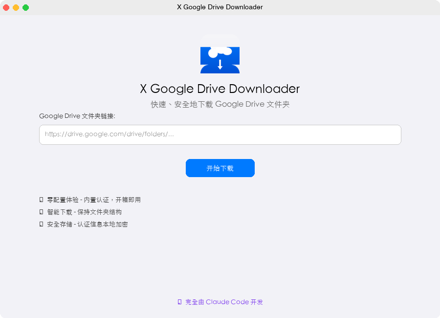
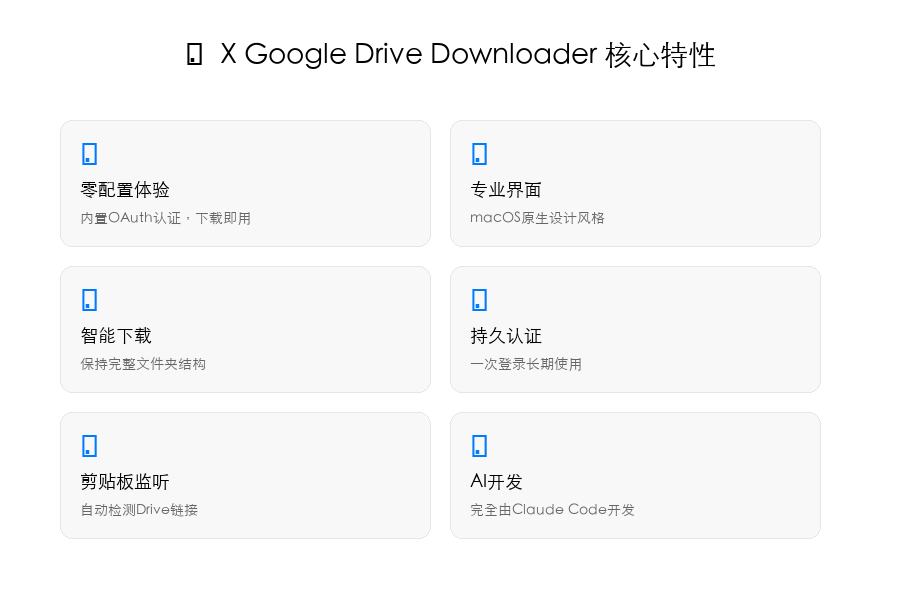
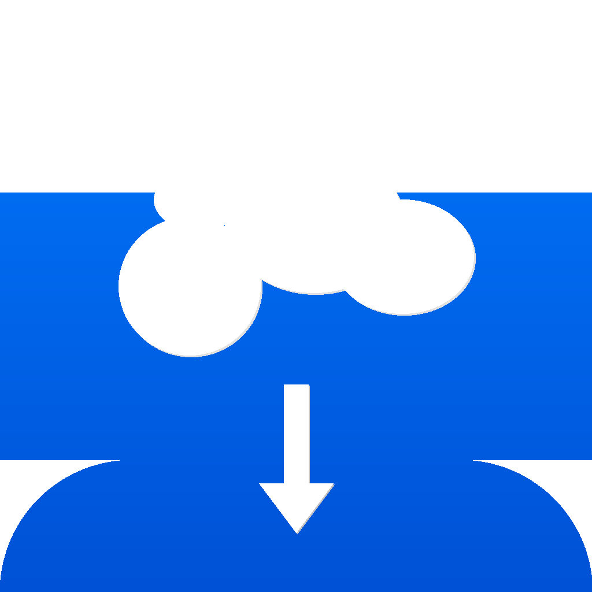

# X Google Drive Downloader

<div align="center">


**快速、安全地批量下载 Google Drive 文件夹**

[](https://github.com/harryboda/x-google-drive-downloader)
[](https://github.com/harryboda/x-google-drive-downloader/releases/latest)
[](LICENSE)
[](https://claude.ai/code)

🤖 **此项目完全由 [Claude Code](https://claude.ai/code) 开发，无人工干预** - 展示AI在现代软件开发中的能力

[📥 下载 DMG](https://github.com/harryboda/x-google-drive-downloader/releases/latest) | [🐛 报告问题](https://github.com/harryboda/x-google-drive-downloader/issues) | [📖 使用指南](#使用方法) | [🤖 AI开发声明](AI_DEVELOPMENT.md)

</div>

## 🆕 v2.1.0 更新 (必要更新)

⚠️ **重要**: v2.0.0存在认证问题，请立即更新到v2.1.0

### 修复的关键问题
- ✅ 修复OAuth令牌获取卡顿问题
- ✅ 修复认证后黑屏导航问题
- ✅ 优化应用启动流程
- ✅ 解决编译错误

## ✨ 特性

🚀 **一键下载** - 复制Google Drive分享链接，一键下载整个文件夹  
🔐 **智能OAuth** - 四层级认证方案，从零配置到企业级定制  
💾 **保持结构** - 完整保留原始文件夹层级结构  
⚡ **智能监听** - 自动检测剪贴板中的Google Drive链接  
🛡️ **安全私密** - 多级加密认证存储，所有数据本地处理  
🎨 **原生体验** - 专为macOS设计的现代化界面  

## 🖼️ 截图

### 主界面


*真实macOS原生界面，完美支持中文显示，专业图标集成*

### 核心功能


*六大核心特性展示，清晰的功能说明和现代化卡片布局*

### 应用图标
<div align="center">

</div>

*符合Apple Human Interface Guidelines的专业级图标设计*

## 📦 安装

### 方法1：下载DMG（推荐）

1. 从 [Releases](https://github.com/harryboda/x-google-drive-downloader/releases/latest) 页面下载最新的 `XGoogleDriveDownloader-v2.1.0.dmg`
2. 双击打开DMG文件
3. 将应用拖拽到 `Applications` 文件夹
4. 首次启动时，右键点击选择"打开"以允许运行

### 方法2：从源码构建

```bash
# 1. 克隆仓库
git clone https://github.com/harryboda/x-google-drive-downloader.git
cd x-google-drive-downloader

# 2. 确保已安装Flutter (>=3.8.1)
flutter --version

# 3. 获取依赖
flutter pub get

# 4. 构建macOS应用
flutter build macos --release

# 5. 应用位置
open build/macos/Build/Products/Release/
```

## 🚀 使用方法

### 🎯 智能OAuth配置

应用首次启动时会自动检测OAuth配置状态，并提供四种配置方案：

1. **🚀 快速开始（推荐）** - 零配置，使用内置安全凭据
2. **⚙️ 自定义配置（高级）** - 使用您的Google Cloud凭据  
3. **🔧 环境变量配置（开发者）** - 向后兼容的开发者模式
4. **🆘 引导配置（兜底）** - 详细的设置指南和帮助

**详细配置指南**: [OAuth认证配置指南](docs/OAUTH_SETUP_GUIDE.md)

### 快速开始

1. **下载安装** - 下载DMG文件并安装到Applications
2. **启动应用** - 首次启动会进入OAuth配置向导
3. **选择方案** - 推荐选择"快速开始"零配置方案
4. **授权访问** - 完成Google账户授权（一次性）
5. **开始下载** - 粘贴Google Drive链接，选择保存位置，开始下载

### 高级功能

- **🔐 多级认证** - 智能的四层级OAuth解决方案
- **📋 自动检测** - 复制Google Drive链接后自动提示下载
- **⚡ 断点续传** - 网络中断后可继续下载  
- **🛡️ 安全存储** - 多级加密的认证信息保护
- **🔄 配置迁移** - 支持从旧版本无缝升级

## 🛠️ 系统要求

- **操作系统**: macOS 10.14 或更高版本
- **架构**: Intel x64 / Apple Silicon (M1/M2)
- **网络**: 稳定的互联网连接
- **存储**: 根据下载内容确定可用空间

## 🔧 开发

### 🤖 Claude Code开发资源

本项目提供完整的AI开发资源，让你也能体验纯AI开发：

- **[本地开发指南](claude_development/LOCAL_DEVELOPMENT_GUIDE.md)** - 使用Claude Code在本地复现开发过程
- **[开发时间线](claude_development/DEVELOPMENT_TIMELINE.md)** - 完整的AI开发过程记录  
- **[技术决策记录](claude_development/TECHNICAL_DECISIONS.md)** - AI架构决策的思考过程
- **[项目配置文件](CLAUDE.md)** - Claude Code项目配置和开发指令

### 技术栈

- **框架**: Flutter 3.8.1+
- **语言**: Dart
- **平台**: macOS Desktop
- **认证**: OAuth 2.0 + Google Drive API
- **存储**: flutter_secure_storage + 本地加密

### 项目结构

```
lib/
├── config/          # 应用配置
├── models/          # 数据模型
├── services/        # 业务服务
│   ├── auth/        # 认证相关
│   └── api/         # API接口
├── ui/             # 用户界面
│   ├── pages/      # 页面
│   ├── widgets/    # 组件
│   └── theme/      # 主题
└── main.dart       # 入口文件
```

### 开发环境设置

1. 安装Flutter SDK
2. 安装Xcode Command Line Tools
3. 配置VSCode/Android Studio
4. 运行 `flutter doctor` 检查环境

### 构建命令

```bash
# 开发模式运行
flutter run -d macos

# 发布版本构建
flutter build macos --release

# 创建DMG安装包
./create_dmg.sh

# 代码分析
flutter analyze

# 运行测试
flutter test
```

## 🤝 贡献

欢迎贡献代码！请遵循以下步骤：

1. Fork 此仓库
2. 创建功能分支: `git checkout -b feature/amazing-feature`
3. 提交更改: `git commit -m 'Add amazing feature'`
4. 推送分支: `git push origin feature/amazing-feature`
5. 创建Pull Request

### 代码规范

- 遵循[Dart Style Guide](https://dart.dev/guides/language/effective-dart)
- 运行 `flutter analyze` 确保无警告
- 添加适当的单元测试
- 更新相关文档

## 📄 许可证

本项目采用 [MIT License](LICENSE) 开源协议。

## 🐛 问题反馈

遇到问题？请通过以下方式反馈：

- [GitHub Issues](https://github.com/harryboda/x-google-drive-downloader/issues)
- 邮件: harryboda@gmail.com

提交问题时请包含：
- 操作系统版本
- 应用版本
- 详细的错误描述
- 复现步骤

## 📚 更多信息

- [隐私政策](docs/PRIVACY_POLICY.md)
- [使用条款](docs/TERMS_OF_SERVICE.md)
- [App Store分发指南](docs/APP_STORE_GUIDE.md)
- [开发文档](docs/)

## 🙏 致谢

- [Flutter](https://flutter.dev/) - 跨平台UI框架
- [Google Drive API](https://developers.google.com/drive) - 文件访问接口
- [Material Design](https://material.io/) - 设计系统参考

---

<div align="center">

**如果这个项目对你有帮助，请给个 ⭐️ !**

Made with ❤️ by [Xiong](https://github.com/harryboda)

</div>